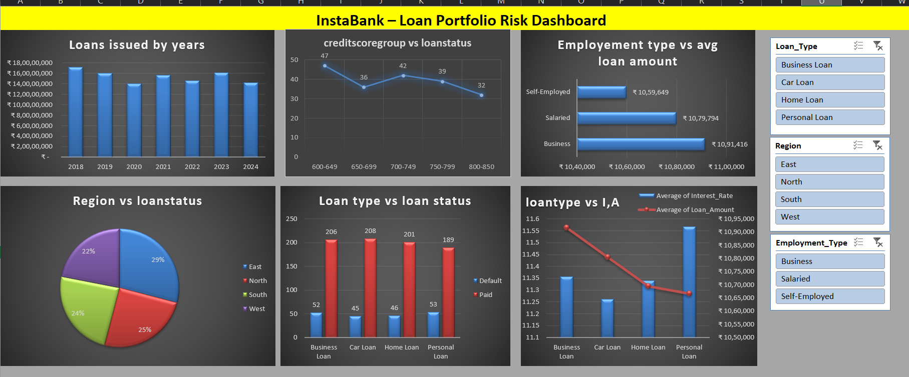

# Financial Risk Analysis - Bank Case Study (Excel Project)

This project focuses on analyzing financial risk factors for bank loan customers using **Microsoft Excel**. The objective of the project is to understand customer loan behavior, evaluate default risk, identify high-risk customer segments, and generate insights that can support decision-making in loan approvals and credit risk management.

---

## 📂 Dataset Overview

The dataset contains customer financial and personal records. Key attributes include:

- **Customer ID** – Unique Identifier
- **Age** – Age of the customer
- **Gender** – Male/Female
- **Income Level** – Monthly/Annual income range
- **Loan Amount** – Amount borrowed by the customer
- **Loan Purpose** – Reason for loan (education, home, business, etc.)
- **Credit Score** – Numerical score indicating creditworthiness
- **Loan Status** – Approved / Rejected / Defaulted
- **Repayment History** – Timely / Late / Missed
- **Risk Category** – Assigned High, Medium, or Low based on financial indicators

---

## 🛠 Tools Used

| Tool | Purpose |
|------|---------|
| **Microsoft Excel** | Data Cleaning, Analysis & Visualization |
| **Pivot Tables** | Summarizing and finding patterns |
| **Excel Charts (Bar, Pie, Donut, Line)** | Visual storytelling |
| **Functions Used** | `IF`, `VLOOKUP`, `COUNTIFS`, `SUMIFS`, `AVERAGE`, `RANK`, etc. |

---

## 🔧 Workflow / Steps Performed

1. **Data Cleaning & Preparation**
   - Removed duplicates
   - Standardized date, text, and numeric formats
   - Handled missing values using logical substitutions
   - Created new derived fields (Income Group, Credit Risk Category)

2. **Exploratory Data Analysis (EDA)**
   - Customer demographics study
   - Loan distribution across income and age groups
   - Credit score behavior analysis
   - Loan default rate identification

3. **Risk Assessment**
   - Categorized customers into **High**, **Medium**, and **Low** risk groups
   - Used pivot tables for risk segment evaluation

4. **Visualization / Dashboard**
   - Designed a clean dashboard summarizing:
     - Default Percentage
     - Top Loan Purposes
     - Risk Category Distribution
     - Credit Score & Loan Amount Relationship

---

## 📊 Key Insights

- Most defaults occur in the **Low Credit Score** group.
- **Young customers (<30 years)** and **customers with low income** show higher repayment instability.
- **Home and Business loans** form the majority of approved loans.
- Customers in **Medium to High-Income Groups** show the most stable repayment patterns.
- Improving **credit score evaluation criteria** can reduce future loan risk.

---

## 📝 Conclusion

Banks can reduce financial risk by:

- Strengthening credit score screening filters
- Providing **financial counseling** to high-risk groups
- Offering smaller, step-wise loan disbursements to new borrowers
- Monitoring repayment behavior using automated alerts

This analysis helps banks make **data-driven decisions** for responsible lending and minimizing loan defaults.

---

## 🚀 Future Scope

- Build an interactive dashboard in **Power BI / Tableau**
- Perform statistical analysis using **Python (Pandas, NumPy, Matplotlib)**
- Train machine learning models to **predict loan default risk**

---

### 📦 Project File Included

- `Financial_Risk_Analysis_Bank_CaseStudy.xlsx`

---

If you found this useful, feel free to ⭐ star the repository!
